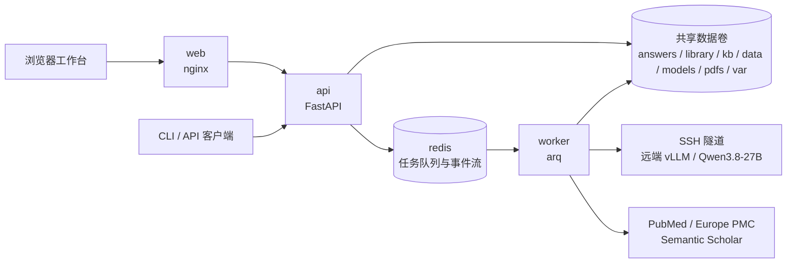

<p align="center">
  <picture>
    <source media="(prefers-color-scheme: dark)" srcset="docs/assets/logo-dark.svg" />
    
  </picture>
</p>

# YAOpenEvidence

YAOpenEvidence 是一套医学文献证据问答系统：从临床或科研问题出发，由 LLM 生成检索式，经 PubMed 与 Europe PMC 检索并获取全文，再按 PICOS 框架逐篇阅读、把引文逐条回到原文核实，生成带段落级引用定位的综述。API 优先交付答案，再可靠地后台提取原子知识并入库；本机 CLI 保持同步入库。系统提供浏览器工作台、本机使用的 `core/PICOSGpt` CLI，以及 `/v1` REST + SSE API。

API 的请求、响应、错误与事件协议见 [API 协议文档](docs/api.md)；CLI 内核的详细用法见 [core/README.md](core/README.md)。

品牌标志以展开的圆角书页与核验勾表达「回到文献原文核实证据」。透明底矢量资源：[浅色背景版](docs/assets/logo.svg)、[深色背景版](docs/assets/logo-dark.svg)、[单色版](docs/assets/logo-mono.svg)，均为 `256 × 256` 画布，无字体或外部资源依赖。深色背景版使用浅青书页与薄荷绿核验勾；单色版内联时可通过 CSS `color` 换色，作为独立图片使用时默认黑色。

三端使用同一组品牌资源，应用内标志沿用各端现有主题机制，不另设主题开关：

| 客户端 | 品牌入口与系统资源 |
| --- | --- |
| Web | 登录、会话恢复、桌面侧栏及折叠态、手机顶栏、问答首页；自适应 SVG favicon、ICO、主屏幕图标与 Web Manifest。应用内手动主题优先于系统设置。 |
| Apple | 登录、会话恢复、问答首页、原生侧栏；图片集自动选择浅色/深色版本，iOS 应用图标提供常规、深色与着色版本，macOS 提供完整尺寸图标。系统启动屏使用动态背景色。 |
| Flutter | 登录、会话恢复、侧栏及折叠态、手机顶栏、问答首页；Android 启动屏、自适应及主题单色图标，Windows ICO 与 Linux 窗口图标。应用内跟随 `ThemeMode`；启动器外观由操作系统决定。 |

修改 SVG 母版后，在仓库根目录执行以下命令同步各端资源；依赖 Python 3.12+ 与 `rsvg-convert`（librsvg），无需额外 Python 包：

```bash
python tools/generate_brand_assets.py
```

生成器以 `docs/assets/logo.svg` 为彩色母版、`docs/assets/logo-mono.svg` 为 Android 单色母版，输出平台所需 SVG、PNG 与多尺寸 ICO。生成资源随代码入库，正常构建客户端不需要图形转换工具；不要直接修改生成的图片。macOS、Windows 与 Linux 的桌面图标使用固定中性浅底，应用内 Logo 仍支持双主题。

## 仓库布局

```text
.
├── core/                    # picosgpt-core：检索、全文解析、PICOS 阅读、知识库与本机 CLI
├── backend/                 # yaoe-backend：FastAPI、数据库迁移、arq worker 与后端测试
├── frontend/                # React 19、Vite、TypeScript、Tailwind 与 shadcn/ui 浏览器前端
├── apple/                   # SwiftUI 多平台客户端（iPhone / iPad / Mac）与本地 YAOEKit 包
├── flutter/                 # Flutter 客户端（Android / Linux / Windows）
├── docs/                    # 面向 API 使用者的协议文档
├── compose.yaml             # nginx web、Redis、迁移、API、worker 与 test profile
├── compose.fake-llm.yaml    # 确定性假 LLM 的 Compose 覆盖配置
├── Dockerfile               # API/worker 共用的 runtime 镜像及 test 镜像
└── var/                     # API SQLite 数据库等运行期状态，不入库
```

根 `pyproject.toml` 定义 uv workspace，成员为 `core/` 的 `picosgpt-core` 与 `backend/` 的 `yaoe-backend`。HTTP 层复用内核包，不另写一套检索或问答逻辑。

前端开发：在 `frontend/` 执行 `pnpm install`、`pnpm gen:api`、`pnpm typecheck`、`pnpm dev`。Vite 默认监听 `http://localhost:5173`，将 `/v1` 同源代理到本机 API 的 `8765` 端口，设置 `YAOE_API_PROXY` 可改写该代理目标（例如指向 Compose 映射出的端口）；生成的 API 类型随代码入库。生产构建使用 `pnpm build`。

浏览器工作台包含文献筛选与实时问答、段落级引用和原文阅读、问答历史、账号设置、管理员用户管理，以及文献库、知识库和上游文献检索。界面为「学术编辑风」：可折叠的全局左侧导航栏、提问页筛选列、大屏答案与原文并排分栏，标题与正文数字使用自托管的 Noto Serif SC 与 Inter（经 `@fontsource-variable` 随构建产物分发，运行时不请求第三方 CDN）。鉴权采用 Bearer 会话；问答仅本人和管理员可见，文献与衍生知识库仍共享，不应提交敏感患者信息。

`pnpm format` 统一前端代码格式，`pnpm typecheck` 检查应用与 Vite 配置，`pnpm test` 运行引用、筛选与任务事件回归；`pnpm gen:api` 从入库 OpenAPI 生成类型，并保留服务端默认字段的可选性。修改 API 契约后需要重新生成。明暗主题默认跟随系统；筛选、手动主题、侧边栏折叠状态与阅读器分栏宽度保存在当前浏览器。

## Apple 客户端（SwiftUI）

`apple/` 是与浏览器工作台功能对等的原生客户端：单一多平台 target 覆盖 iPhone、iPad 与 Mac，最低 iOS 26 / macOS 26，Swift 6 语言模式 + 严格并发。`apple/YAOEKit/` 是本地 SwiftPM 包，承载 Codable 模型、`APIClient` actor、SSE 解析与全部纯逻辑（筛选归一化、引用标记、任务事件归约、Markdown 解析），可脱离 App 用 `swift test` 验证；`apple/YAOpenEvidence/` 只放 SwiftUI 视图与页面模型。

```bash
brew install xcodegen
export DEVELOPER_DIR=/Applications/Xcode-beta.app/Contents/Developer   # 或已切换的 xcode-select
cd apple && xcodegen generate                                          # 生成 YAOpenEvidence.xcodeproj，不入库
xcodebuild -project YAOpenEvidence.xcodeproj -scheme YAOpenEvidence -destination 'platform=macOS' build
xcodebuild -project YAOpenEvidence.xcodeproj -scheme YAOpenEvidence -destination 'platform=iOS Simulator,name=iPhone 17' build
cd YAOEKit && swift test
```

工程描述集中在 `apple/project.yml`（XcodeGen），Bundle ID 为 `plus.ling.YAOpenEvidence`；仓库内没有开发者账号，默认使用 ad-hoc 签名（`CODE_SIGN_IDENTITY = "-"`），换成自己的团队时改这三行签名设置即可。App 沙箱只申请 `network.client`，ATS 仅放开本地网络：明文 `http://` 服务器地址必须是 localhost 或私有网段，公网主机需使用 https。

客户端首屏要求填写服务器地址（默认 `http://localhost:8765`）与账号密码；令牌存 Keychain，`expires_at`、用户资料与服务器地址存 UserDefaults，任何受保护端点返回 401 即清会话回登录页。问答进度走 `GET /v1/jobs/{id}/events` 的 SSE：1 秒起指数退避重连（上限 10 秒）、重连前用 `/v1/auth/me` 探活、SSE 未连通时每 5 秒兜底轮询答案。界面遵循 Apple HIG（系统字体与语义色、`sidebarAdaptable` 侧栏、regular 宽度用检查器展示原文阅读器），只保留品牌深青 accent、8 色引用色板与 Q1–Q4 分区色。

界面按 iOS 26 规范打磨：提问与追问用悬浮的大圆角玻璃输入框（`glassEffect`，发送键在框内、筛选摘要作胶囊），玻璃只用于悬浮控件层，内容卡片一律是 `secondarySystemBackground` 平面填充；答案页的输入框仿 Safari 地址栏三档收放（聚焦 / 有草稿 / 提交中是完整形态，静止收成单行，向下滚动再横向缩成居中小药丸），输入框始终留在视图树上，焦点与草稿不会在收放间丢失；历史、文献库与用户列表是无限滚动而非分页按钮；知识库与查文献用原生 `.searchable`（知识库带「全部 / 事实 / 段落」搜索范围）；滚动时收起底部 Tab 栏，关键操作带触觉反馈。面向用户的界面刻意不展示 SSE 连接状态、运行日志、候选文献原始数据、检索式、相关性打分、嵌入模型与相似度这类开发者信息——检索式移到「…」菜单的 sheet 里，其余只保留在 Web 端与后端日志。

## Flutter 客户端（Android / Linux / Windows）

`flutter/` 是第三个功能对等客户端，覆盖 Apple 平台之外的手机与桌面：Flutter 3.47.2（Dart 3.13）、Material 3 + 自定义设计令牌、Riverpod 3 状态管理、go_router 18 路由、freezed 4 模型。SDK 版本由 `flutter/.fvmrc` 固定，所有命令走 `fvm`。iOS/macOS 由 `apple/` 覆盖、Web 由 `frontend/` 覆盖，故未生成对应平台目录。

```bash
cd flutter
fvm install                      # 按 .fvmrc 安装 3.47.2
tool/fetch_fonts.sh              # 下载并裁剪自带字体（产物已入库，仅需更新时执行）
fvm flutter pub get
fvm dart run build_runner build  # 生成 *.g.dart / *.freezed.dart（已入库）
fvm flutter analyze && fvm flutter test
fvm flutter run -d linux         # 或 -d <android-device>
```

分层：`lib/core/`（模型、`ApiClient` + SSE、纯逻辑）、`lib/app/`（主题令牌、路由、会话无关的全局状态）、`lib/features/`（按页面分包）、`lib/shared/`（跨页组件与格式化）。纯逻辑与 API 层逐字对照 `apple/YAOEKit/`，测试用例集同源移植，可用 `fvm flutter test` 单独验证。

界面沿用 web 的「学术编辑风」：暖纸色背景 + 深青主色、衬线标题（自带裁剪版 Noto Serif SC）、正文数字用 Inter、8 色引用色板与 Q1–Q4 分区色。布局三档自适应：`< 768` 底部导航 + 「更多」表单、`768–1279` 折叠图标侧栏、`≥ 1280` 240 px 可折叠侧栏（`Ctrl/Cmd+B`）并支持答案与原文并排分栏（分隔条可拖拽，比例持久化）。令牌存系统安全存储（Android EncryptedSharedPreferences、Linux libsecret、Windows DPAPI）；平台无安全存储时回退为明文偏好并在账号页显式提示。明文 `http://` 服务器地址同样只允许本地网络，公网必须 https。

视觉基准与 iOS 版对齐（`apple/YAOpenEvidence/Components/Surface.swift` 的 `Metrics`）：卡片圆角 16、页面内边距 16、阅读列 720、区块间距 20/28；内容层是无描边的卡片 + 两层柔和阴影（Flutter 的页面底色与卡片色差极小，靠阴影而非描边分层），玻璃只用于悬浮控件层——提问与追问是 `BackdropFilter` 模糊的大圆角悬浮输入框（发送键在框内、引擎与筛选摘要作胶囊），向下滚动时它和手机底部导航栏一起滑出、向上滚动 / 触顶触底 / 聚焦时恢复；答案页的操作收进头部「⋯」菜单（重新提问 / 查看检索式 / 删除），检索式单独成面不占正文。面向用户的界面同样刻意不展示 SSE 连接状态、运行日志、检索式、相似度打分、嵌入模型与维度这类开发者信息。

构建：Linux 桌面需要 `clang`、`cmake`、`ninja`、`gtk3`、`libsecret`；Android 需要 Android SDK 与 JDK 17（`fvm flutter config --android-sdk ... --jdk-dir ...`）。Windows 目录随模板入库，但只能在 Windows 主机上构建。

## 架构



问答流水线通常运行数分钟，因此 API 只负责接收请求、持久化任务并入队，独立 worker 执行耗时工作；`YAOE_WORKER_MAX_JOBS` 默认为 `1`，适合单 GPU 串行执行。任务事件使用 Redis Stream 而非 Pub/Sub，因为 SSE 客户端断线后需要携带 `Last-Event-ID` 续传历史事件。取消采用协作式机制：API 写入取消标记，worker 在阶段边界和逐篇处理边界检查；已经开始的单次 LLM 调用不会被强行中断。

`ask` 引擎开启 `use_kb` 时，API 将 `Answer.ready`、问答任务成功及独立的 `answer_kb` 后台任务在同一数据库事务中保存；问答的 `job.result.kb_job_id` 指向后台任务。答案和逐篇原文此时已经可读，后台失败或取消不会改写、撤回答案。Web 答案页单独显示入库状态；三端不再把未执行的 `kb` 阶段显示为前台等待步骤。`use_kb=false` 不创建后台任务；`kb_hits` 仍只引用既有知识，不等待本次文献入库。

后台由数据库持久任务驱动，worker 启动和每 10 秒扫描恢复，Redis 投递失败不会丢掉任务。每次只处理一篇；有其他种类任务排队或运行时，不派发下一篇。已开始的一篇不会被抢占，所以新问答最多仍需等待当前篇完成，而不是等待整批入库。事实抽取完成后原子保存检查点，重试可复用；每篇最多尝试 3 次，逐篇保存恢复游标。取消后台任务不回滚此前已写入的文献。多个 worker 必须共享 `answers/`、`library/`、`kb/` 与 `var/`，且共享文件系统须支持 POSIX 文件锁及原子重命名；`var/answer-kb.lock` 保证跨进程后台串行，运行期间不要删除锁文件。本机 CLI 不走后台队列，仍同步抽取与索引。

### 两个问答引擎

`POST /v1/answers` 的 `engine` 决定 worker 走哪条路：

| | `ask`（默认） | `codex` |
|---|---|---|
| 执行方式 | 固定流水线：检索 → 取全文 → 逐篇阅读 → 综合 | Codex agent 自己决定调哪些工具 |
| 工具面 | 流水线内部直接调 `core/literature.py` 等 | core 的 `semantic_scholar` MCP（与 `./PICOSGpt codex` 同一套） |
| 产出 | `body_md` 分节 + 逐篇原文快照 + 段落级引用 | 整篇 `answer_md` + `trace`（结构化工具调用轨迹），无原文快照 |
| 生效筛选 | 全部字段，服务端硬过滤 | 年份/分区/期刊等翻成检索要求交给模型 |
| 多轮 | 每次提问独立 | 同一 codex 会话可 `POST /v1/answers/{id}/followup` 续接追问 |

codex 运行时随 `openai-codex` 依赖一起进镜像（`openai-codex-cli-bin` 带 codex 二进制，不需要 node，也不读 `~/.codex/config.toml`）：provider 与 MCP 全部走每次会话的内联配置，复用 `LLM_BASE` / `LLM_MODEL` / `LOCAL_QWEN_KEY`，因此必须是支持 **Responses API**（`/v1/responses`）的端点——codex 0.147 起不再支持 chat 线协议。当前远端 vLLM 同时提供 Chat Completions 和 Responses API，无需 LiteLLM 中转。会话文件落在 `CODEX_HOME`（镜像内为 `/data/var/codex`，随 `./var` 卷持久化）。

服务端运行以 `sandbox=read-only` + `approval_mode=deny_all` 启动，工作目录是 `CODEX_HOME/work` 空目录而非代码树。注意这两项只挡住写入与升权批准：**read-only 不限制读取范围**，`cwd` 也只是工作目录，真正的租户隔离靠容器与运行用户，多租户对外开放前必须在容器/进程层面隔离。

## 快速开始：Docker Compose

需要 Docker、Docker Compose，以及可供容器访问、同时支持 Chat Completions 和 Responses API 的模型服务。

### 1. 准备配置和目录

```bash
cp .env.example .env
mkdir -p var core/pdfs
```

账号存储在 API 数据库中，不再配置静态 API Key。不要在公开网络上以明文 HTTP 传输密码或会话令牌。

### 2. 连接模型服务

当前项目接入远端 **Qwen3.8-27B NVFP4**（服务模型名 `Qwen3.8-27B`，上下文上限 262144；2026-09-19 由 FP8 权重切换而来，见下文）。模型仅监听远端 `127.0.0.1:29913`，通过两跳 SSH 隧道接入，不向公网开放无鉴权 API。在 `.env` 设置：

```dotenv
COMPOSE_FILE=compose.yaml:compose.qwen.yaml
LLM_BASE=http://llm-tunnel:29913/v1
LLM_MODEL=Qwen3.8-27B
LOCAL_QWEN_KEY=EMPTY
YAOE_JOB_TIMEOUT_S=86400
```

`.llm-ssh/` 保存专用 `id_ed25519`、固定主机指纹的 `known_hosts` 和 OpenSSH `config`，均不提交，也不进入镜像构建上下文。密钥仅挂载到隧道容器，不放入 API、worker 可读取的 `var/` 卷。目录权限为 `700`，私钥和配置为 `600`。配置中的 `qwen-target` 经 `qwen-jump` 连接；两者都指定 `/ssh/id_ed25519`、`IdentitiesOnly yes`、`BatchMode yes`、`StrictHostKeyChecking yes` 和 `UserKnownHostsFile /ssh/known_hosts`。具体地址与用户名只写入本地配置。

在两台机器登记公钥前须取得授权；公钥选项使用 `restrict,port-forwarding,command="/bin/false",permitopen="目的地址:端口"`，跳板只允许转发到目标 SSH 端口，目标只允许转发到 `127.0.0.1:29913`。不保存密码，不放开 shell 权限，也不禁用主机指纹校验。迁移主机时重新登记专用公钥，不能只复制 Compose 文件。

`llm-tunnel` 容器以只读方式挂载密钥，自动重启；API 和 worker 等待隧道健康后启动。宿主机仅在 `127.0.0.1:29913` 发布端口，宿主机直接运行 Python 时将 `LLM_BASE` 覆盖为 `http://127.0.0.1:29913/v1`。远端 vLLM 应启用 `--reasoning-parser qwen3 --enable-auto-tool-choice --tool-call-parser qwen3_xml`。

2026-09-17 已在单张 L20 上完成部署侧对照并发布：vLLM `0.29.0+cu129`，保留 Marlin FP8 权重内核、FP8 KV、FLASHINFER、前缀缓存及 262144 上下文；启用 `speculative_config={"method":"mtp","num_speculative_tokens":1}`，将 `max_num_seqs` 设为 `4`、`gpu_memory_utilization` 设为 `0.92`。这些参数集中保存在模型主机 `/data1/lings/Qwen3_8_27B/deployment.json`，由同目录 `serve.py` 读取；不属于本项目 Compose 参数。KV 总容量约 266637 tokens，四路只是调度上限，**不代表可同时运行四份 256K 请求**。

独立重启后的确认结果如下（相同输入，每项三轮取中位数；单流开启思考，四篇阅读关闭思考）：

| 热前缀固定输出负载 | 原配置：无 MTP、两路 | 当前配置：MTP 单步、四路 | 耗时减少 |
| --- | ---: | ---: | ---: |
| 单流综合，输入 14318、生成 1024 tokens | 42.58 秒 | 27.56 秒 | 35.3% |
| 四篇阅读闭合批次，每篇生成 512 tokens | 48.50 秒 | 20.49 秒 | 57.8% |

确认轮 MTP 草稿接受率为 94.39%，没有 KV 抢占；八路上限没有超出波动的批次收益，Triton 线性后端反而更慢，均未采用。MTP 两步及三步在显存比例 0.92 下无法容纳完整 256K，未以缩短上下文换速度。上述固定输出额度**仅用于性能基准**，不是生产生成限制，也不能把这些百分比当作完整八篇问答提速或开放到达吞吐量。功能验收实际输入 261192 tokens，正确找回开头校验码并自然结束；Responses、自动工具调用通过。真实单篇问答使用检索所得摘要，273.53 秒完成，综合包含 8670 个思考 tokens、以 `stop` 自然结束；这是通路验收，不是医学精度评估。

原始测量、Prometheus 指标、输入和校验清单保存在模型主机 `/data1/lings/Qwen3_8_27B/performance/20260917-mtp1-seq4/`，当前验收追加于 `verification.json` 的 `performance_tuning_20260917`，原有记录保留为调优前证据。服务由用户级 `lings-qwen38-27b-29913.service` 托管；授权管理会话可运行 `/data1/lings/Qwen3_8_27B/.venv/bin/python /data1/lings/Qwen3_8_27B/service.py restart`，随后须等待 `/health` 成功，不能只看 systemd 的 `active`。回滚时先暂停请求生产者并确认模型无进行中请求，停止该 unit，将同目录 `serve.py.pre-tune-20260917`、`deployment.json.pre-tune-20260917` **成对恢复**为原文件，再启动、验证健康并恢复 Worker；不要给生产转发密钥扩大 shell 权限。本轮未升级共享 GPU 驱动，也未调整其他 GPU 服务。

2026-09-18 该服务已迁到同机另一张 L20（`gpu_uuid` 由 GPU3 改为 `GPU-5166f61d-9213-e2b6-2077-93d850834675`），原因是 GPU3 被同机另一项目的训练占用；迁卡只改 `deployment.json` 的 `gpu_uuid` 一个字段，其余参数不变，迁后 KV 总容量仍为 266637 tokens，原文件备份为 `deployment.json.pre-gpu2-20260918`。同时把 unit 的 `Restart=on-failure` 改为 `Restart=always`（`RestartSec=30`），并新增 `ExecStartPre=.venv/bin/python gpu_guard.py`：该脚本按 `deployment.json` 的 `gpu_uuid` 与 `gpu_memory_utilization` 计算所需空闲显存（当前 42383MiB），不足则以退出码 1 拒绝启动并写入 `logs/server.log`，交给 `RestartSec` 重试。这样被外部 `SIGTERM`（退出码 0，`on-failure` 不触发重启）能自愈，而他人占卡时不会硬抢或把对方挤爆；手工核查可用 `gpu_guard.py --uuid <UUID>` 或 `--min-free-mib <N>`。unit 原文件备份为 `lings-qwen38-27b-29913.service.pre-restart-always-20260918`。共享 GPU 的归属仍需与同机项目约定，加固不能替代约定。

2026-09-18 晚，同机另一项目再次取走 GPU2（journal 记录 `10:11:04 Succeeded.`，即我方进程又被外部 `SIGTERM` 后以退出码 0 退出），`gpu_guard.py` 随后拒绝启动 474 次——加固按设计没有与对方抢卡，但也说明该机已不具备稳定容量。因此整套服务已迁至 A6000 主机 `tx-06`（ZeroTier 地址 `10.107.231.181`）的 GPU3（`GPU-7d090f4e-ef66-e2e0-4774-1d5daa48d1cd`，RTX A6000 49140MiB，该卡仅另有一个 488MiB 的容器常驻；同机 GPU0/1/2 被三个 ollama 容器按 `DeviceIDs` 钉死，不会漂移到 GPU3）。目录结构与 slave2 完全一致（`/data1/lings/Qwen3_8_27B`，该机 `/data1` 由 `sudo` 建出 `lings` 子目录并授予 `tx`），因此 `serve.py`、`service.py`、`gpu_guard.py`、unit 文件无需改路径。

A6000 侧的实测结果：`GPU KV cache size: 347,528 tokens, Maximum concurrency for 262,144 tokens per request: 1.33x`，比 L20 的 266637 tokens 多约 30%；`MarlinFP8ScaledMMLinearKernel`、`AttentionBackendEnum.FLASHINFER`、`--kv-cache-dtype fp8`、MTP 单步全部生效。**A6000 是 sm_86 且无原生 FP8，但 FP8 KV 在 FlashInfer 路径上可用**——vLLM 里 “FP8 KV 需 SM89+” 的硬门槛只在 Triton 路径，配置探针与真实启动都通过；`marlin_utils_fp8` 的 no-native-FP8 告警与 L20 上一致，不是本机特有问题。

复刻该环境时注意四处与 slave2 不同的坑：一是解释器必须用 uv 装的 CPython 3.12.14（`UV_PYTHON_INSTALL_DIR=<项目>/runtime/python`），系统 `python3.11` 是 Ubuntu 的 `3.11.0rc1`，缺 `sys.get_int_max_str_digits`，`import torch` 直接失败；二是**不能**用 PyPI 默认的 `vllm==0.29.0`/`torch==2.13.0`，它们依赖 `nvidia-*-cu13`，需要 r580+ 驱动，而该机驱动是 560.35.05（CUDA 12.6），必须用 GitHub release 的 `vllm-0.29.0+cu129`（SHA256 `22e8d8fe…89fe`，与 slave2 同一制品）配 `requirements.lock` 里的 `+cu129` 轮子；三是该机国际源只有 KB/s，普通包走清华 pypi（约 10MB/s）、torch 系列走上海交大或阿里云 `pytorch-wheels/cu129`、权重走 ModelScope（约 5MB/s，29G 约 2 小时），GitHub release 走 `gh.xxooo.cf` 镜像（约 1.7MB/s）后用 SHA 校验；四是该机 `/usr/bin/nvcc` 是 CUDA 11.5，FlashInfer JIT 会用它编译并因 `nvcc fatal: Unknown option '--compress-mode=size'` 失败，故 `serve.py` 增加 `CUDA_HOME=/usr/local/cuda` 并把 `/usr/local/cuda/bin` 放进 `PATH`（该机 `/usr/local/cuda -> cuda-12.6`），原文件备份为 `serve.py.pre-cuda-home-20260918`。权重按 `model-manifest.json` 从 ModelScope 重新拉取并逐文件 SHA256 校验，79 个文件全部通过，脚本保留在 `tools/fetch_weights.py`，可重复运行。

隧道侧改了两处：`.llm-ssh/config` 的 `qwen-target` 指向 `10.107.231.181`；跳板上该专用公钥的 `permitopen` 由只允许 `10.107.231.69:22` 扩为同时允许 `10.107.231.181:22`（否则隧道报 `channel 0: open failed: administratively prohibited`），跳板 `authorized_keys` 备份为 `authorized_keys.pre-a6000-20260918`。A6000 上按同样的 `restrict,port-forwarding,command="/bin/false",permitopen="127.0.0.1:29913"` 登记了同一公钥，首连指纹 `SHA256:dkS36ZUg3B/OjLveBBl4JWvLHMv7i5u517xIdeRw5Kc`（ssh-ed25519）已写入 `.llm-ssh/known_hosts`。

slave2 上的 unit 已 `stop` 并移除 `default.target.wants` 软链（`UnitFileState=linked`），文件、权重与备份全部保留；但该机两张 L20 现已被对方占满，**回滚需要先协调出一张空卡**，不是改回 `.llm-ssh/config` 就能生效。

2026-09-19 生产权重由 **FP8 + MTP 单步** 切换为 **NVFP4 + DSpark 七步投机解码**。NVFP4 权重为 `RedHatAI/Qwen3.8-27B-NVFP4`（ModelScope，14 文件 23.44 GB，逐文件 SHA256 校验）放在 `models/Qwen3.8-27B-NVFP4`，草稿模型 `RadixArk/Qwen3.8-27B-DSpark` 放在 `performance/nvfp4-dspark-20260919/draft`。`serve.py` 改动三处：模型路径改读 `config.get("model", …FP8)`、`--kv-cache-dtype` 改读 `config.get("kv_cache_dtype", "fp8")`、新增可选 `--linear-backend`；`deployment.json` 增加 `model`、`kv_cache_dtype: "fp8"`、`linear_backend: "marlin"`，并把 `speculative_config` 换成 `{"method":"dspark","model":"…/draft","num_speculative_tokens":7}`。两份原文件备份为 `serve.py.fp8-mtp.bak` 与 `deployment.json.fp8-mtp.bak`，回滚即成对恢复后 `systemctl --user restart lings-qwen38-27b-29913.service` 并等待 `/health` 成功（同目录 `rollback_guard.sh` 会在健康检查失败时自动做这件事）。

**`--linear-backend marlin` 是必需项，不是调优项**：auto 内核下 compressed-tensors 会给 NVFP4 权重选 W8A16 FP8 scheme，启动崩在 `humming_utils.py:489` 的 `AttributeError: 'ParallelLMHead' object has no attribute 'output_partition_sizes'`。另外 **nvfp4 KV cache 在本机不可用**——FlashInfer 的 `is_device_capability_family(100)` 只放行 Blackwell，A6000 为 sm_86，因此 KV 仍是 fp8。切换后实测 `Using MarlinNvFp4LinearKernel for NVFP4 GEMM`、`GPU KV cache size: 300,434 tokens, Maximum concurrency for 262,144 tokens per request: 1.15x`（FP8 时为 347,528 / 1.33x，仍大于单请求 262144 上下文，且 worker 串行执行）。

切换依据是用生产真实 prompt 做的对照评测（3 道真实问题 × (2 篇 read + 1 次 synthesize) = 9 个任务，输入从 `core/answers/<id>_papers/` 存档逐字重建，与生产当时一致）：read 阶段 35.71 → 98.98 tok/s（2.77x），synthesize 阶段 37.91 → 101.43 tok/s（2.68x）。质量侧加跑了同配置第二轮作为采样噪声基线：引用原文核验率 fp8 0.979 / fp8 复跑 0.956 / nvfp4 0.943，跨配置差值小于配置自身波动；PICOS 六标题三轮均 6/6；综合阶段非法引用标记三轮均为 0；相关性判分 nvfp4 与存档生产 4/4 一致而 fp8 复跑反而出现 2 处不一致；盲评（A/B 正反序各一次）忠实度 3/3 平局、双方均无编造数字、结论方向 3/3 一致。**这是"未观察到超出采样噪声的劣化"，不是"证明无劣化"**：样本为 3 题 9 任务 3 轮，后续如发现答案质量回退，按上面的备份成对回滚即可。切换后端到端验收：真实问答任务 260 秒完成（切换前同类任务 297~610 秒），产出 7 篇论文、58 个引用标记全部合法、16/16 条引文核实通过。

流水线保留现有逐阶段策略：检索、阅读、事实抽取显式关闭思考，综合阶段开启思考；Codex 使用服务端默认思考。检索、阅读、事实抽取（含单篇入库）和综合阶段均不发送 `thinking_token_budget` 或 `max_tokens`，不再设置应用层输出或独立思考额度，由 vLLM 按剩余上下文分配可生成额度；当前模型总上下文为 262144 tokens，输入、思考和正文共享，不能真正无限。综合请求取消生成读取超时，连接、写入和连接池等待仍保留 30 秒超时；其他阶段保留 600 秒读取超时。当前远端部署将 `YAOE_JOB_TIMEOUT_S` 设为 86400（24 小时），不要设为 0（队列会立即超时），也不要直接关闭队列超时而破坏运行锁的有效期。长思考可能占用单卡数小时并阻塞后续任务，现有取消机制在流水线阶段边界生效。空正文或 `finish_reason=length` 仍会使任务明确失败，不会保存为完成答案。放宽额度不保证回答更准确，也不代表已完成医学领域精度评估。

固定流水线的模型调用每次尝试都会输出 `llm_metrics {JSON}` 日志，沿用现有 `log` 事件，不改变 SSE 事件类型或 `llm()` 返回值。字段包含 `stage`、`operation`、`request_id`、`attempt`、`model`、`response_id`、`success`、`elapsed_s`、`finish_reason`，以及服务端返回的 `prompt_tokens`、`completion_tokens`、`reasoning_tokens`、`cached_tokens`；缺失用量为 `null`，不是零。`elapsed_s` 是客户端单次调用总耗时，不能据此拆分服务端排队、预填充与解码时间。日志不包含提示词、回答正文或密钥；这些度量用于分析耗时，不改变生成额度、思考策略或上下文长度。后台事实抽取的日志归属于 `answer_kb` 任务，而非已经完成的问答任务。

如使用其他兼容端点，移除 `COMPOSE_FILE` 并设置其地址、模型名和密钥即可；基础 Compose 默认仍访问宿主机 `http://host.docker.internal:4000/v1`。`core/PICOSGpt start` 是旧版宿主机本地模型启动方案，不用于上述远端部署。

### 3. 启动工作台与后端

```bash
docker compose up -d --build
docker compose exec api yaoe create-admin admin
curl http://localhost:8765/v1/health/ready
```

`migrate` 服务先执行 Alembic 迁移；迁移成功后 `api` 和 `worker` 才启动。应用不会在进程启动时自行迁移数据库。

浏览器打开 `http://localhost:39109`，使用管理员创建的账号登录。默认使用选定的高位端口 39109，`YAOE_WEB_PORT` 可覆盖为其他空闲端口。nginx 将 `/v1/` 同源代理到 API，关闭代理缓冲以即时传输 SSE，并支持 `/a/<id>`、`/library/<key>` 等深链刷新；无需配置 CORS。生产环境应在入口启用 HTTPS。

`create-admin` 会交互读取并确认密码，没有默认账号或密码。通过管理员登录取得 `access_token`：

```bash
curl -s -X POST http://localhost:8765/v1/auth/login \
  -H 'Content-Type: application/json' \
  -d '{"username":"admin","password":"<your-admin-password>"}'
```

使用返回的令牌创建第一个问答任务：

```bash
curl -i -X POST http://localhost:8765/v1/answers \
  -H 'Authorization: Bearer <access_token>' \
  -H 'Content-Type: application/json' \
  -d '{"question":"SGLT2抑制剂对HFpEF患者有什么获益？","papers":2,"years":3,"use_kb":false}'
```

响应为 `202 Accepted`，并包含答案位置与异步任务信息。订阅进度、读取答案和处理错误的完整示例见 [API 协议文档](docs/api.md)。

Compose 将同一组宿主机目录挂载给 API 与 worker：

| 宿主机目录 | 容器目录 | 内容 |
|---|---|---|
| `core/answers/` | `/data/answers/` | 综述与每次问答的逐篇材料 |
| `core/library/` | `/data/library/` | 规范化全文、段落、事实与文献元数据 |
| `core/kb/` | `/data/kb/` | 向量、索引元数据与 embedder 信息 |
| `core/data/` | `/data/data/` | 期刊分区等静态数据 |
| `core/models/` | `/data/models/` | 本地 embedding 模型；容器内只读 |
| `core/pdfs/` | `/data/pdfs/` | 本地 PDF |
| `var/` | `/data/var/` | API SQLite 数据库等状态 |

Redis 自身使用名为 `redis-data` 的持久卷。

## 无 GPU 的端到端验证

以下覆盖配置启动 `backend/tests/fake_llm.py` 提供的确定性假 LLM，并让 API 和 worker 指向它：

```bash
docker compose -f compose.yaml -f compose.fake-llm.yaml up -d --build
```

它可以执行完整问答流水线而不需要 GPU，但文献检索与全文获取仍需访问 PubMed 和 Europe PMC；假 LLM 只替代模型服务，不替代外部文献源。假 LLM 同时提供 `/v1/chat/completions`（`ask` 用）与 `/v1/responses`（`codex` 用）两条线协议，因此两个引擎都能在这套配置下跑通。

`codex` 的工具闭环也能在这套配置下验证：提问里带 `TOOLTEST_PDF=<pdfs/ 下的文件名>` 时，假模型第一轮会真的调 MCP 的 `read_pdf`，第二轮把工具返回的原文抄进答案。据此可断言 `Answer.trace` 非空（`tool` 为 `read_pdf`、`status` 为 `completed`）且答案含 PDF 原文——工具执行断了这条断言就会失败。同一条闭环也由 `backend/tests/test_codex_engine.py` 覆盖（真起 codex 运行时与 MCP 子进程，不打桩）。

## 本地开发

要求 Python 3.12、uv 与一个 Redis 实例。

```bash
uv sync --all-packages
docker run -d --name yaoe-redis -p 6379:6379 redis:7-alpine

uv run --directory backend yaoe migrate
uv run --directory backend yaoe create-admin admin
uv run --directory backend yaoe serve
# 另开终端
uv run --directory backend yaoe worker
```

`serve` 默认监听 `127.0.0.1:8765`。先迁移数据库，再创建管理员；同一数据库只需首次建号，不要在每次启动时重复执行。

本机测试：

```bash
uv run pytest -q
```

测试会对 Redis 执行 `FLUSHDB`。未显式设置时测试配置使用 `redis://127.0.0.1:6379/15`；如果设置了 `YAOE_REDIS_URL`，它必须指向本机且数据库编号不小于 `10`，否则测试会直接报错并拒绝运行。

### Amp orbs

新 orb 的 `.agents/setup` 安装 Python 3.12、Redis 和 `uv.lock` 锁定的全部 workspace / 开发依赖（含 CPU PyTorch）。Amp 快照保留工具链、`.venv` 与 uv 缓存；重复 setup 只同步缺失或变化的依赖。使用 `uv run` 无需手动激活虚拟环境。

`.agents/resume` 在激活和唤醒时通过 `.amp/services.yaml` 确保 Redis 运行；Redis 只监听回环地址、不开放 portal、不启用磁盘持久化，仅用于可丢弃的开发任务。可直接运行 `uv run pytest -q`，或用 `amp orb services ensure` 修复服务。

setup 不复制面向 Docker 的 `.env.example`，不创建账号、不下载模型，也不保存登录凭据。运行 API 前按上述本地开发步骤执行迁移和创建管理员；真实问答仍需配置可访问的 LLM，或按无 GPU 验证说明使用假 LLM。机构订阅下载的可选依赖和登录态不预装。

Compose 的规范测试方式：

```bash
docker compose --profile test run --rm test
```

## 用户与登录会话

系统只有 `user` 和 `admin` 两种角色，不开放注册。管理员通过 `POST /v1/users` 创建用户，或通过本机命令创建管理员：

```bash
uv run --directory backend yaoe create-admin admin
uv run --directory backend yaoe reset-password admin
```

两条命令默认交互读取并确认密码；自动化可用 `--password-stdin` 从标准输入读取，不接受明文密码命令行参数。用户名为 3-64 位 ASCII 字母数字、下划线、横线或点，以字母数字开头，统一转小写且不区分大小写；密码为 12-128 字符，以 Argon2id 哈希保存。

| 角色 | 权限边界 |
|---|---|
| `user` | 创建和读取自己的问答、任务与阅读材料，取消自己的任务、删除自己的终态答案；共享读取文献、KB、期刊与上游检索 |
| `admin` | 具备普通用户能力，可查看和管理所有问答及任务、重建 KB、创建账号、启用/禁用账号与重置密码 |

账号只能启用/禁用，不支持删除或修改角色；禁止禁用自己或最后一个活跃管理员。禁用不会删除已有问答，也不会自动取消已经排队或执行中的任务。

`POST /v1/auth/login` 返回随机 Bearer 令牌，默认固定有效期 7 天，不自动续期；数据库只保存令牌的 SHA-256 摘要。`GET /v1/auth/me` 读取当前账号；`POST /v1/auth/logout` 仅注销当前会话；修改或重置密码、禁用账号会撤销全部会话，重新启用也不会恢复旧令牌。过期后重新登录，不引入 JWT 或刷新令牌。

所有受保护端点（包括 SSE）只接受 `Authorization: Bearer <access_token>`，不再接受 URL 查询令牌。浏览器请使用能带请求头的流式客户端，不能直接使用原生 `EventSource`。生产环境必须使用 HTTPS，并避免将令牌写入日志、URL 或不必要的持久化存储。

个人问答私有，但文献和衍生知识仍共享；当前知识提取使用问题作为上下文，因此这不是严格的用户隐私或租户隔离，不应提交敏感个人或患者信息。健康探针、API 描述和登录端点免鉴权，其余接口必须登录。

### 从静态 API Key 升级

先停止 API 和 worker 并备份数据库及结果目录，再执行迁移、创建管理员，最后启动服务。迁移 `0002` 保留旧任务、答案和关联关系；旧 Key 及 CLI 导入数据不猜测用户归属，`user_id` 为 `null`，仅管理员可见。旧 `api_key_id` 字段、静态 Key 鉴权、`YAOE_API_KEYS_FILE` 和 `YAOE_AUTH_DISABLED` 已移除；所有客户端必须先登录。已有本地 `backend/api_keys.toml` 不读取、不随迁移删除，仍被版本控制和镜像构建排除。

`YAOE_MAX_ACTIVE_JOBS_PER_KEY` 改为 `YAOE_MAX_ACTIVE_JOBS_PER_USER`，同一用户的多个令牌共享额度。完整请求体、错误码和 SSE 接入方式见 [API 协议文档](docs/api.md)。

## 环境变量

### 后端：`YAOE_*`

下表与 `backend/app/config.py` 的 `Settings` 字段一一对应；Compose 会覆盖其中部分默认值。

| 变量 | 代码默认值 | 作用 |
|---|---|---|
| `YAOE_REDIS_URL` | `redis://127.0.0.1:6379/0` | arq 队列、任务事件流与取消标记使用的 Redis |
| `YAOE_DATABASE_URL` | 空；随后解析为 `sqlite:///<PICOSGPT_DATA>/var/api.sqlite3` | SQLAlchemy 数据库 URL；包含 `%` 时按原 URL 填写，无需为迁移命令额外转义 |
| `YAOE_SESSION_TTL_S` | `604800` | 登录会话固定有效期（秒），必须大于 0 |
| `YAOE_LOGIN_MAX_ATTEMPTS` | `10` | 单个用户名在登录窗口内的最大请求数，含成功登录，必须大于 0 |
| `YAOE_LOGIN_WINDOW_S` | `300` | 登录限流窗口（秒），必须大于 0 |
| `YAOE_CORS_ORIGINS` | `[]` | 允许的 CORS origin；可用逗号分隔或 JSON 数组 |
| `YAOE_HOST` | `127.0.0.1` | `yaoe serve` 默认监听地址 |
| `YAOE_PORT` | `8765` | `yaoe serve` 默认端口；Compose 也用它设置宿主机映射端口 |
| `YAOE_WORKER_MAX_JOBS` | `1` | 单个 worker 同时执行的最大任务数 |
| `YAOE_JOB_TIMEOUT_S` | `1800` | worker 任务超时秒数；当前远端 Qwen 部署设为 `86400`（24 小时） |
| `YAOE_MAX_ACTIVE_JOBS_PER_USER` | `2` | 每个用户允许的 queued/running 任务上限，多个会话共享，必须大于 0 |
| `YAOE_EVENTS_TTL_S` | `604800` | Redis 任务事件流与取消标记的保留秒数，默认 7 天 |
| `YAOE_EVENTS_MAXLEN` | `2000` | 每个任务 Redis Stream 的近似最大事件数 |
| `YAOE_UPLOAD_MAX_MB` | `50` | `POST /v1/papers/upload` 单个 PDF 的大小上限（MB），必须大于 0 |

Compose 固定容器内的 Redis 为 `redis://redis:6379/0`、数据库为 `sqlite:////data/var/api.sqlite3`；`.env` 中的 `YAOE_PORT` 控制宿主机端口映射。

### 内核与上游服务

| 变量 | 默认值 | 作用 |
|---|---|---|
| `PICOSGPT_DATA` | `core/` | 数据根目录；容器中设为 `/data` |
| `LLM_BASE` | `http://127.0.0.1:4000/v1` | OpenAI 兼容 LLM API 根地址 |
| `LLM_MODEL` | `qwen3-14b` | 模型名；就绪检查也验证该模型是否由网关提供 |
| `LOCAL_QWEN_KEY` | `sk-123456` | 调用 LLM 网关的 Bearer key |
| `EMBED_MODEL` | `<PICOSGPT_DATA>/models/BAAI/bge-m3` | sentence-transformers embedding 模型路径 |
| `NCBI_API_KEY` | 空 | NCBI/PubMed API key，可选 |
| `S2_API_KEY` | 空 | Semantic Scholar API key，可选 |
| `SD_STATE_PATH` | `<PICOSGPT_DATA>/var/sd_state.json` | 机构订阅下载器的登录状态文件；另有同名的 `.session_storage.json` 与 `.context.json` 两份伴随文件 |
| `PAYWALL_MAX_PER_RUN` | `5` | 每次问答最多尝试的机构订阅下载数 |
| `S2_TIMEOUT` | `30` | 文献上游 HTTP 请求超时秒数 |
| `CODEX_HOME` | `<PICOSGPT_DATA>/var/codex` | codex 会话与运行状态目录；镜像内已设为 `/data/var/codex` |
| `CODEX_MCP_STARTUP_TIMEOUT_S` | `60` | codex 引擎等待 MCP 工具服务启动的秒数 |
| `CODEX_MCP_TOOL_TIMEOUT_S` | `180` | codex 引擎单次 MCP 工具调用的超时秒数 |

`PICOSGPT_DATA` 决定所有运行期数据的位置。本地未设置时以 `core/` 为根，容器内为 `/data`。其下的 `answers/` 保存问答输出，`library/` 保存逐篇文献材料，`kb/` 保存知识库索引，`data/journal_ranks/` 保存期刊分区表，`models/` 保存 embedding 模型，`pdfs/` 保存本地 PDF（入库任务落在 `pdfs/ingest/`），`var/` 保存 API 数据库、机构登录态等运行状态。

## CLI 与 API 共存

`core/PICOSGpt` 和 HTTP worker 调用同一套 `core/` 代码，并可通过 `PICOSGPT_DATA` 使用同一份 `answers`、`library` 与 `kb` 数据。现有 CLI 的行为和命令保持不变，详细说明见 [CLI 内核文档](core/README.md)。

知识库通过同一数据根目录下的 `kb.lock` 协调 CLI 与 worker 写入，要求 POSIX 系统及支持 `flock`、原子文件替换的共享数据卷。重建从读取 `library/` 到发布索引全程持有写锁，新增入库会等待；搜索不持写锁，并在单次检索内固定使用同一代向量与元数据。重建在等待锁、逐篇处理和最终发布前检查取消标记，取消或超时后未发布的快照会被丢弃。运行期间不要删除锁文件，也不要混用不遵循该锁协议的旧版写者。

API 不会在启动时自动扫描 CLI 时代的 `answers/<时间戳>.md`。部署迁移完成后，可执行一次：

```bash
docker compose run --rm api yaoe import-answers
```

本地等价命令为：

```bash
uv run --directory backend yaoe import-answers
```

该命令幂等地把尚未登记的 Markdown 答案导入数据库，使其可通过 API 浏览；它不会把旧答案补造成结构化逐篇 paper 数据。

## 运维与排障

### 就绪检查

`GET /v1/health/ready` 返回五项检查：

| check | 检查内容 |
|---|---|
| `db` | 数据库能否执行 `SELECT 1` |
| `redis` | Redis 能否响应 `PING` |
| `llm` | LLM `/models` 是否可达并包含 `LLM_MODEL` |
| `kb` | 索引头（`kb/index.npz`，旧布局为 `kb/info.json`）是否存在且非空，并报告 embedder、维度和条目数 |
| `ranks` | `data/journal_ranks/` 下是否加载到期刊分区表 |

任一项失败时 `status` 为 `degraded`。只有 `db` 或 `redis` 失败才返回 HTTP `503`；LLM、KB 或分区表失败时仍返回 HTTP `200`，因为只读浏览等能力仍可使用。

### 常见问题

- **改了 `core/` 或 `backend/` 源码但线上行为没变**：Dockerfile 是把源码 `COPY` 进镜像，不是挂载，容器跑的是构建时的副本，重启容器不生效。必须重建后重启：`docker compose up -d --build api worker`。改了 `frontend/` 则重建 `web`。
- **验证重建是否真的上线**：不要只看容器 `Up`。先经浏览器同源地址探活 `curl http://localhost:39109/v1/health/ready`（走 nginx，可一并验证代理层是否通），再用 `docker compose exec worker python -c "import ask; ..."` 确认容器内的代码确实是新版本。`nginx.conf` 已改为经 Docker DNS 动态解析 `api`，因此单独重建 API 不再需要连带重启 `web`。
- **KB 索引与 embedder 不一致**：使用 admin key 调用 `POST /v1/kb/reindex`，或在 `core/` 下运行 `./PICOSGpt kb reindex`。不要用一套 embedding 维度读取另一套索引。
- **首次 KB 检索较慢**：bge-m3 首次请求会惰性加载，实测约需 15 秒并占用约 2 GiB 内存。
- **机构订阅下载在容器内不可用**：runtime 镜像已装 Playwright Chromium（`playwright install --with-deps chromium`）。先看 `GET /v1/paywall/status`：`playwright_available=false` 说明镜像里没装成浏览器，`configured=false` 说明还没上传登录态——在有桌面的机器上跑 `core/PICOSGpt paywall login`，再经 `/admin/institution` 上传三份文件。
- **Semantic Scholar 返回 429**：`source=auto` 的文献搜索会在 Semantic Scholar 上游失败时自动回退 PubMed，并在响应中给出回退原因。
- **任务看似串行**：单 worker 的 `YAOE_WORKER_MAX_JOBS` 默认为 `1`，这是单 GPU 的预期配置。扩展多个 worker 副本时，所有副本必须挂载同一份数据卷。
- **GPU 版 PyTorch**：workspace 当前把 `torch` 固定到 CPU wheel 索引。GPU 部署需将根 `pyproject.toml` 的 `pytorch-cpu` 索引改为对应 CUDA 索引，再运行 `uv lock`。

## 开发约定

后端保持清晰分层：`backend/app/routers/` 只负责 HTTP 校验、鉴权和序列化，`backend/app/services/` 承担业务逻辑，`core/` 不感知 HTTP 的存在。协议发生有意变更后，重新导出 OpenAPI：

```bash
uv run --directory backend yaoe export-openapi
```

导出的 `backend/openapi.json` 应随代码入库，供各前端 codegen 使用；面向人的 wire 协议同步维护在 [docs/api.md](docs/api.md)。

### API 契约迁移

- 取消任务使用 `POST /v1/jobs/{job_id}/cancel`，接受后返回 `202` 与任务 `Location`；`DELETE /v1/answers/{id}` 仅删除终态结果，活动态返回 `409`。
- 文献详情改为 `/v1/literature/resolve?ident=...`，全文及引文操作同样通过 `ident` 查询参数寻址；旧标识符路径不再保留。
- HTTP 完整 Markdown 引用指向本次答案的 `/papers/{n}/markdown#p{pid}` 快照，客户端带 Bearer 加载并渲染段落锚点；CLI 本地文件链接不变。
- SSE 的 `Last-Event-ID` 在响应启动前校验；查询凭证与事件模型通过 OpenAPI 的 `SSEAccessToken` 和 `x-sse-events` 声明。CORS 支持续传请求头并暴露 `Location`。
- 错误响应使用 `application/problem+json`，Markdown 使用 `text/markdown`；就绪探针 `200/503` 使用同一健康模型。升级后重新生成客户端，详细迁移规则见 [API 协议](docs/api.md#10-契约迁移)。

---

本项目输出为文献综述，仅供科研与教学参考，不构成医疗建议。
