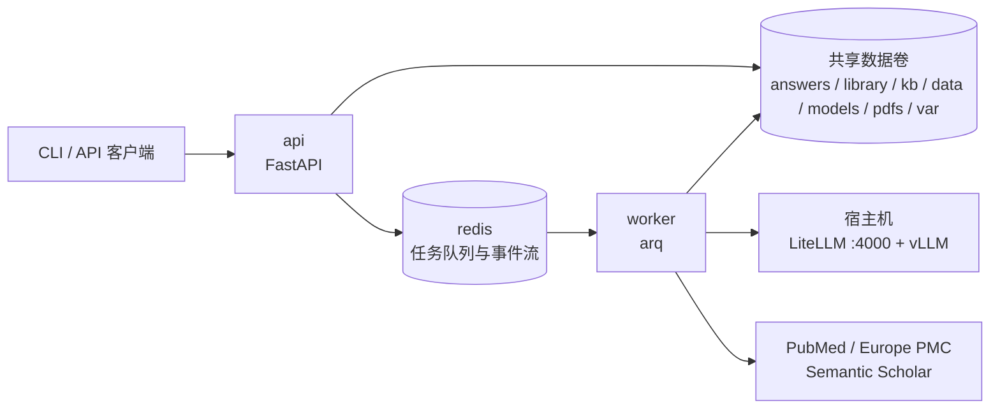

# YAOpenEvidence

YAOpenEvidence 是一套医学文献证据问答系统：从临床或科研问题出发，由 LLM 生成检索式，经 PubMed 与 Europe PMC 检索并获取全文，再按 PICOS 框架逐篇阅读、把引文逐条回到原文核实、将原子知识写入本地知识库，最终生成带段落级引用定位的综述。系统提供两个使用面：本机使用的 `core/PICOSGpt` CLI，以及通过容器部署的 `/v1` REST + SSE API。

API 的请求、响应、错误与事件协议见 [API 协议文档](docs/api.md)；CLI 内核的详细用法见 [core/README.md](core/README.md)。

## 仓库布局

```text
.
├── core/                    # picosgpt-core：检索、全文解析、PICOS 阅读、知识库与本机 CLI
├── backend/                 # yaoe-backend：FastAPI、数据库迁移、arq worker 与后端测试
├── frontend/                # React 19、Vite、TypeScript、Tailwind 与 shadcn/ui 浏览器前端
├── docs/                    # 面向 API 使用者的协议文档
├── compose.yaml             # Redis、迁移、API、worker 与 test profile
├── compose.fake-llm.yaml    # 确定性假 LLM 的 Compose 覆盖配置
├── Dockerfile               # API/worker 共用的 runtime 镜像及 test 镜像
└── var/                     # API SQLite 数据库等运行期状态，不入库
```

根 `pyproject.toml` 定义 uv workspace，成员为 `core/` 的 `picosgpt-core` 与 `backend/` 的 `yaoe-backend`。HTTP 层复用内核包，不另写一套检索或问答逻辑。

前端开发：在 `frontend/` 执行 `pnpm install`、`pnpm gen:api`、`pnpm typecheck`、`pnpm dev`。Vite 默认监听 `http://localhost:5173`，将 `/v1` 同源代理到本机 API 的 `8765` 端口；生成的 API 类型随代码入库。生产构建使用 `pnpm build`。

## 架构



问答流水线通常运行数分钟，因此 API 只负责接收请求、持久化任务并入队，独立 worker 执行耗时工作；`YAOE_WORKER_MAX_JOBS` 默认为 `1`，适合单 GPU 串行执行。任务事件使用 Redis Stream 而非 Pub/Sub，因为 SSE 客户端断线后需要携带 `Last-Event-ID` 续传历史事件。取消采用协作式机制：API 写入取消标记，worker 在阶段边界和逐篇处理边界检查；已经开始的单次 LLM 调用不会被强行中断。

## 快速开始：Docker Compose

需要 Docker、Docker Compose，以及可供容器访问的宿主机 LiteLLM/vLLM。

### 1. 准备配置和目录

```bash
cp .env.example .env
mkdir -p var core/pdfs
```

账号存储在 API 数据库中，不再配置静态 API Key。不要在公开网络上以明文 HTTP 传输密码或会话令牌。

### 2. 在宿主机启动模型服务

```bash
cd core
./PICOSGpt start
cd ..
```

默认 Compose 配置通过 `http://host.docker.internal:4000/v1` 访问 LiteLLM。

### 3. 启动后端

```bash
docker compose up -d --build
docker compose exec api yaoe create-admin admin
curl http://localhost:8765/v1/health/ready
```

`migrate` 服务先执行 Alembic 迁移；迁移成功后 `api` 和 `worker` 才启动。应用不会在进程启动时自行迁移数据库。

`create-admin` 会交互读取并确认密码，没有默认账号或密码。通过管理员登录取得 `access_token`：

```bash
curl -s -X POST http://localhost:8765/v1/auth/login \
  -H 'Content-Type: application/json' \
  -d '{"username":"admin","password":"<your-admin-password>"}'
```

使用返回的令牌创建第一个问答任务：

```bash
curl -i -X POST http://localhost:8765/v1/answers \
  -H 'Authorization: Bearer <access_token>' \
  -H 'Content-Type: application/json' \
  -d '{"question":"SGLT2抑制剂对HFpEF患者有什么获益？","papers":2,"years":3,"use_kb":false}'
```

响应为 `202 Accepted`，并包含答案位置与异步任务信息。订阅进度、读取答案和处理错误的完整示例见 [API 协议文档](docs/api.md)。

Compose 将同一组宿主机目录挂载给 API 与 worker：

| 宿主机目录 | 容器目录 | 内容 |
|---|---|---|
| `core/answers/` | `/data/answers/` | 综述与每次问答的逐篇材料 |
| `core/library/` | `/data/library/` | 规范化全文、段落、事实与文献元数据 |
| `core/kb/` | `/data/kb/` | 向量、索引元数据与 embedder 信息 |
| `core/data/` | `/data/data/` | 期刊分区等静态数据 |
| `core/models/` | `/data/models/` | 本地 embedding 模型；容器内只读 |
| `core/pdfs/` | `/data/pdfs/` | 本地 PDF |
| `var/` | `/data/var/` | API SQLite 数据库等状态 |

Redis 自身使用名为 `redis-data` 的持久卷。

## 无 GPU 的端到端验证

以下覆盖配置启动 `backend/tests/fake_llm.py` 提供的确定性假 LLM，并让 API 和 worker 指向它：

```bash
docker compose -f compose.yaml -f compose.fake-llm.yaml up -d --build
```

它可以执行完整问答流水线而不需要 GPU，但文献检索与全文获取仍需访问 PubMed 和 Europe PMC；假 LLM 只替代模型服务，不替代外部文献源。

## 本地开发

要求 Python 3.12、uv 与一个 Redis 实例。

```bash
uv sync --all-packages
docker run -d --name yaoe-redis -p 6379:6379 redis:7-alpine

uv run --directory backend yaoe migrate
uv run --directory backend yaoe create-admin admin
uv run --directory backend yaoe serve
# 另开终端
uv run --directory backend yaoe worker
```

`serve` 默认监听 `127.0.0.1:8765`。先迁移数据库，再创建管理员；同一数据库只需首次建号，不要在每次启动时重复执行。

本机测试：

```bash
uv run pytest -q
```

测试会对 Redis 执行 `FLUSHDB`。未显式设置时测试配置使用 `redis://127.0.0.1:6379/15`；如果设置了 `YAOE_REDIS_URL`，它必须指向本机且数据库编号不小于 `10`，否则测试会直接报错并拒绝运行。

### Amp orbs

新 orb 的 `.agents/setup` 安装 Python 3.12、Redis 和 `uv.lock` 锁定的全部 workspace / 开发依赖（含 CPU PyTorch）。Amp 快照保留工具链、`.venv` 与 uv 缓存；重复 setup 只同步缺失或变化的依赖。使用 `uv run` 无需手动激活虚拟环境。

`.agents/resume` 在激活和唤醒时通过 `.amp/services.yaml` 确保 Redis 运行；Redis 只监听回环地址、不开放 portal、不启用磁盘持久化，仅用于可丢弃的开发任务。可直接运行 `uv run pytest -q`，或用 `amp orb services ensure` 修复服务。

setup 不复制面向 Docker 的 `.env.example`，不创建账号、不下载模型，也不保存登录凭据。运行 API 前按上述本地开发步骤执行迁移和创建管理员；真实问答仍需配置可访问的 LLM，或按无 GPU 验证说明使用假 LLM。机构订阅下载的可选依赖和登录态不预装。

Compose 的规范测试方式：

```bash
docker compose --profile test run --rm test
```

## 用户与登录会话

系统只有 `user` 和 `admin` 两种角色，不开放注册。管理员通过 `POST /v1/users` 创建用户，或通过本机命令创建管理员：

```bash
uv run --directory backend yaoe create-admin admin
uv run --directory backend yaoe reset-password admin
```

两条命令默认交互读取并确认密码；自动化可用 `--password-stdin` 从标准输入读取，不接受明文密码命令行参数。用户名为 3-64 位 ASCII 字母数字、下划线、横线或点，以字母数字开头，统一转小写且不区分大小写；密码为 12-128 字符，以 Argon2id 哈希保存。

| 角色 | 权限边界 |
|---|---|
| `user` | 创建和读取自己的问答、任务与阅读材料，取消自己的任务、删除自己的终态答案；共享读取文献、KB、期刊与上游检索 |
| `admin` | 具备普通用户能力，可查看和管理所有问答及任务、重建 KB、创建账号、启用/禁用账号与重置密码 |

账号只能启用/禁用，不支持删除或修改角色；禁止禁用自己或最后一个活跃管理员。禁用不会删除已有问答，也不会自动取消已经排队或执行中的任务。

`POST /v1/auth/login` 返回随机 Bearer 令牌，默认固定有效期 7 天，不自动续期；数据库只保存令牌的 SHA-256 摘要。`GET /v1/auth/me` 读取当前账号；`POST /v1/auth/logout` 仅注销当前会话；修改或重置密码、禁用账号会撤销全部会话，重新启用也不会恢复旧令牌。过期后重新登录，不引入 JWT 或刷新令牌。

所有受保护端点（包括 SSE）只接受 `Authorization: Bearer <access_token>`，不再接受 URL 查询令牌。浏览器请使用能带请求头的流式客户端，不能直接使用原生 `EventSource`。生产环境必须使用 HTTPS，并避免将令牌写入日志、URL 或不必要的持久化存储。

个人问答私有，但文献和衍生知识仍共享；当前知识提取使用问题作为上下文，因此这不是严格的用户隐私或租户隔离，不应提交敏感个人或患者信息。健康探针、API 描述和登录端点免鉴权，其余接口必须登录。

### 从静态 API Key 升级

先停止 API 和 worker 并备份数据库及结果目录，再执行迁移、创建管理员，最后启动服务。迁移 `0002` 保留旧任务、答案和关联关系；旧 Key 及 CLI 导入数据不猜测用户归属，`user_id` 为 `null`，仅管理员可见。旧 `api_key_id` 字段、静态 Key 鉴权、`YAOE_API_KEYS_FILE` 和 `YAOE_AUTH_DISABLED` 已移除；所有客户端必须先登录。已有本地 `backend/api_keys.toml` 不读取、不随迁移删除，仍被版本控制和镜像构建排除。

`YAOE_MAX_ACTIVE_JOBS_PER_KEY` 改为 `YAOE_MAX_ACTIVE_JOBS_PER_USER`，同一用户的多个令牌共享额度。完整请求体、错误码和 SSE 接入方式见 [API 协议文档](docs/api.md)。

## 环境变量

### 后端：`YAOE_*`

下表与 `backend/app/config.py` 的 `Settings` 字段一一对应；Compose 会覆盖其中部分默认值。

| 变量 | 代码默认值 | 作用 |
|---|---|---|
| `YAOE_REDIS_URL` | `redis://127.0.0.1:6379/0` | arq 队列、任务事件流与取消标记使用的 Redis |
| `YAOE_DATABASE_URL` | 空；随后解析为 `sqlite:///<PICOSGPT_DATA>/var/api.sqlite3` | SQLAlchemy 数据库 URL；包含 `%` 时按原 URL 填写，无需为迁移命令额外转义 |
| `YAOE_SESSION_TTL_S` | `604800` | 登录会话固定有效期（秒），必须大于 0 |
| `YAOE_LOGIN_MAX_ATTEMPTS` | `10` | 单个用户名在登录窗口内的最大请求数，含成功登录，必须大于 0 |
| `YAOE_LOGIN_WINDOW_S` | `300` | 登录限流窗口（秒），必须大于 0 |
| `YAOE_CORS_ORIGINS` | `[]` | 允许的 CORS origin；可用逗号分隔或 JSON 数组 |
| `YAOE_HOST` | `127.0.0.1` | `yaoe serve` 默认监听地址 |
| `YAOE_PORT` | `8765` | `yaoe serve` 默认端口；Compose 也用它设置宿主机映射端口 |
| `YAOE_WORKER_MAX_JOBS` | `1` | 单个 worker 同时执行的最大任务数 |
| `YAOE_JOB_TIMEOUT_S` | `1800` | worker 任务超时秒数 |
| `YAOE_MAX_ACTIVE_JOBS_PER_USER` | `2` | 每个用户允许的 queued/running 任务上限，多个会话共享，必须大于 0 |
| `YAOE_EVENTS_TTL_S` | `604800` | Redis 任务事件流与取消标记的保留秒数，默认 7 天 |
| `YAOE_EVENTS_MAXLEN` | `2000` | 每个任务 Redis Stream 的近似最大事件数 |

Compose 固定容器内的 Redis 为 `redis://redis:6379/0`、数据库为 `sqlite:////data/var/api.sqlite3`；`.env` 中的 `YAOE_PORT` 控制宿主机端口映射。

### 内核与上游服务

| 变量 | 默认值 | 作用 |
|---|---|---|
| `PICOSGPT_DATA` | `core/` | 数据根目录；容器中设为 `/data` |
| `LLM_BASE` | `http://127.0.0.1:4000/v1` | OpenAI 兼容 LLM API 根地址 |
| `LLM_MODEL` | `qwen3-14b` | 模型名；就绪检查也验证该模型是否由网关提供 |
| `LOCAL_QWEN_KEY` | `sk-123456` | 调用 LLM 网关的 Bearer key |
| `EMBED_MODEL` | `<PICOSGPT_DATA>/models/BAAI/bge-m3` | sentence-transformers embedding 模型路径 |
| `NCBI_API_KEY` | 空 | NCBI/PubMed API key，可选 |
| `S2_API_KEY` | 空 | Semantic Scholar API key，可选 |
| `SD_STATE_PATH` | `<PICOSGPT_DATA>/sd_state.json` | 机构订阅下载器的登录状态文件 |
| `PAYWALL_MAX_PER_RUN` | `5` | 每次问答最多尝试的机构订阅下载数 |
| `S2_TIMEOUT` | `30` | 文献上游 HTTP 请求超时秒数 |

`PICOSGPT_DATA` 决定所有运行期数据的位置。本地未设置时以 `core/` 为根，容器内为 `/data`。其下的 `answers/` 保存问答输出，`library/` 保存逐篇文献材料，`kb/` 保存知识库索引，`data/journal_ranks/` 保存期刊分区表，`models/` 保存 embedding 模型，`pdfs/` 保存本地 PDF，`var/` 保存 API 数据库等运行状态。

## CLI 与 API 共存

`core/PICOSGpt` 和 HTTP worker 调用同一套 `core/` 代码，并可通过 `PICOSGPT_DATA` 使用同一份 `answers`、`library` 与 `kb` 数据。现有 CLI 的行为和命令保持不变，详细说明见 [CLI 内核文档](core/README.md)。

知识库通过同一数据根目录下的 `kb.lock` 协调 CLI 与 worker 写入，要求 POSIX 系统及支持 `flock`、原子文件替换的共享数据卷。重建从读取 `library/` 到发布索引全程持有写锁，新增入库会等待；搜索不持写锁，并在单次检索内固定使用同一代向量与元数据。重建在等待锁、逐篇处理和最终发布前检查取消标记，取消或超时后未发布的快照会被丢弃。运行期间不要删除锁文件，也不要混用不遵循该锁协议的旧版写者。

API 不会在启动时自动扫描 CLI 时代的 `answers/<时间戳>.md`。部署迁移完成后，可执行一次：

```bash
docker compose run --rm api yaoe import-answers
```

本地等价命令为：

```bash
uv run --directory backend yaoe import-answers
```

该命令幂等地把尚未登记的 Markdown 答案导入数据库，使其可通过 API 浏览；它不会把旧答案补造成结构化逐篇 paper 数据。

## 运维与排障

### 就绪检查

`GET /v1/health/ready` 返回五项检查：

| check | 检查内容 |
|---|---|
| `db` | 数据库能否执行 `SELECT 1` |
| `redis` | Redis 能否响应 `PING` |
| `llm` | LLM `/models` 是否可达并包含 `LLM_MODEL` |
| `kb` | 索引头（`kb/index.npz`，旧布局为 `kb/info.json`）是否存在且非空，并报告 embedder、维度和条目数 |
| `ranks` | `data/journal_ranks/` 下是否加载到期刊分区表 |

任一项失败时 `status` 为 `degraded`。只有 `db` 或 `redis` 失败才返回 HTTP `503`；LLM、KB 或分区表失败时仍返回 HTTP `200`，因为只读浏览等能力仍可使用。

### 常见问题

- **KB 索引与 embedder 不一致**：使用 admin key 调用 `POST /v1/kb/reindex`，或在 `core/` 下运行 `./PICOSGpt kb reindex`。不要用一套 embedding 维度读取另一套索引。
- **首次 KB 检索较慢**：bge-m3 首次请求会惰性加载，实测约需 15 秒并占用约 2 GiB 内存。
- **容器内无法使用机构订阅下载**：镜像不包含 `core/vendor/`，`paywall_fetch` 不可用；v1 容器部署明确不支持该下载路径。本机 CLI 仍可按内核文档配置。
- **Semantic Scholar 返回 429**：`source=auto` 的文献搜索会在 Semantic Scholar 上游失败时自动回退 PubMed，并在响应中给出回退原因。
- **任务看似串行**：单 worker 的 `YAOE_WORKER_MAX_JOBS` 默认为 `1`，这是单 GPU 的预期配置。扩展多个 worker 副本时，所有副本必须挂载同一份数据卷。
- **GPU 版 PyTorch**：workspace 当前把 `torch` 固定到 CPU wheel 索引。GPU 部署需将根 `pyproject.toml` 的 `pytorch-cpu` 索引改为对应 CUDA 索引，再运行 `uv lock`。

## 开发约定

后端保持清晰分层：`backend/app/routers/` 只负责 HTTP 校验、鉴权和序列化，`backend/app/services/` 承担业务逻辑，`core/` 不感知 HTTP 的存在。协议发生有意变更后，重新导出 OpenAPI：

```bash
uv run --directory backend yaoe export-openapi
```

导出的 `backend/openapi.json` 应随代码入库，供各前端 codegen 使用；面向人的 wire 协议同步维护在 [docs/api.md](docs/api.md)。

### API 契约迁移

- 取消任务使用 `POST /v1/jobs/{job_id}/cancel`，接受后返回 `202` 与任务 `Location`；`DELETE /v1/answers/{id}` 仅删除终态结果，活动态返回 `409`。
- 文献详情改为 `/v1/literature/resolve?ident=...`，全文及引文操作同样通过 `ident` 查询参数寻址；旧标识符路径不再保留。
- HTTP 完整 Markdown 引用指向本次答案的 `/papers/{n}/markdown#p{pid}` 快照，客户端带 Bearer 加载并渲染段落锚点；CLI 本地文件链接不变。
- SSE 的 `Last-Event-ID` 在响应启动前校验；查询凭证与事件模型通过 OpenAPI 的 `SSEAccessToken` 和 `x-sse-events` 声明。CORS 支持续传请求头并暴露 `Location`。
- 错误响应使用 `application/problem+json`，Markdown 使用 `text/markdown`；就绪探针 `200/503` 使用同一健康模型。升级后重新生成客户端，详细迁移规则见 [API 协议](docs/api.md#10-契约迁移)。

---

本项目输出为文献综述，仅供科研与教学参考，不构成医疗建议。
